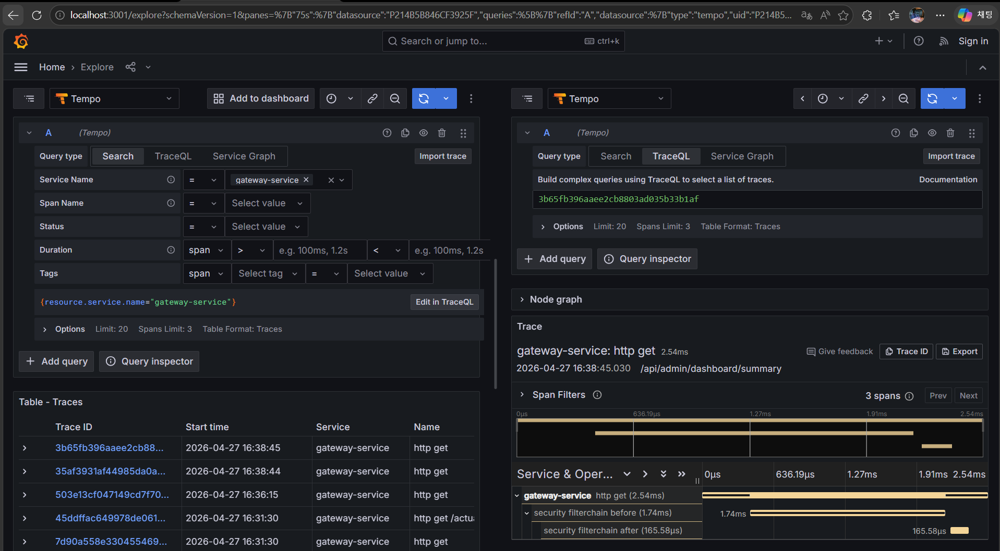
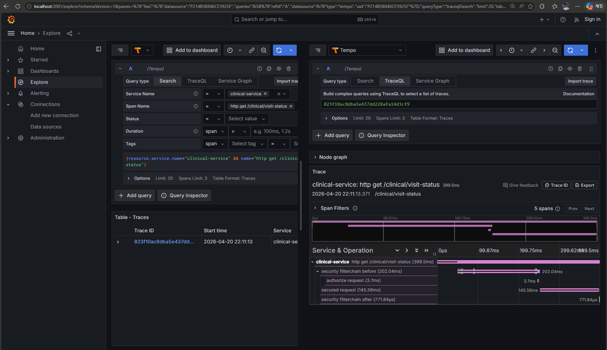
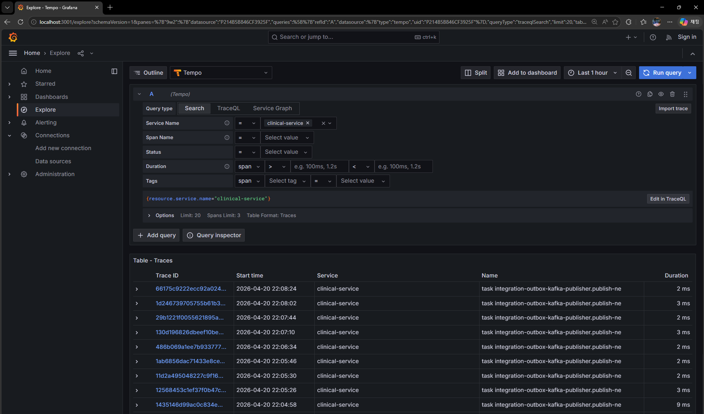
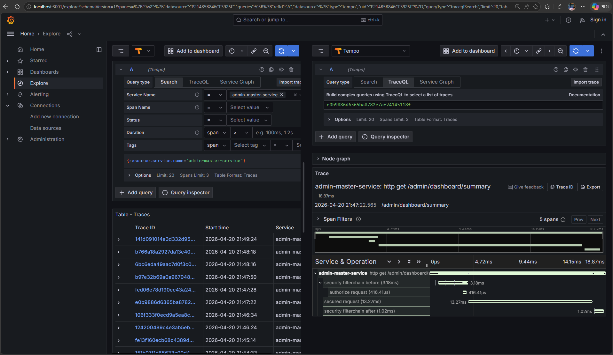
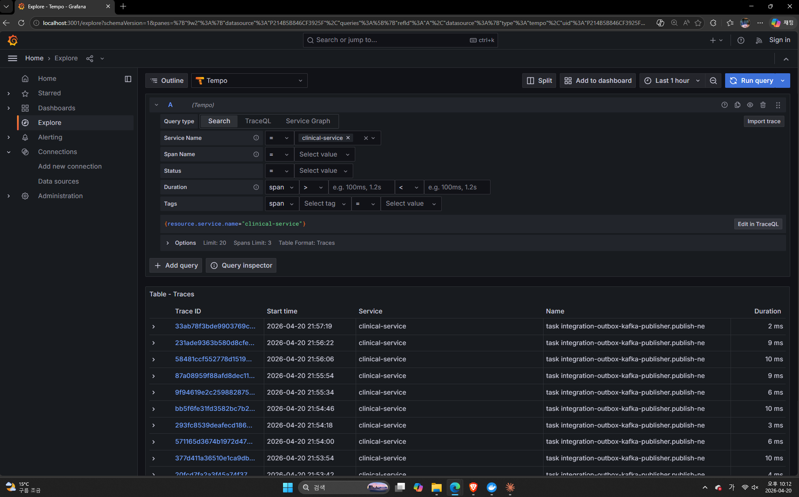
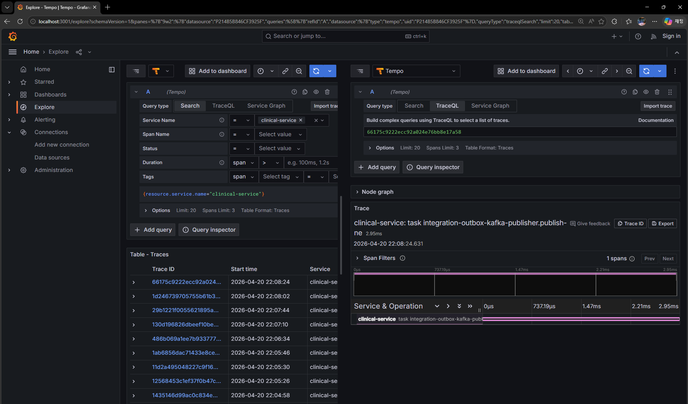
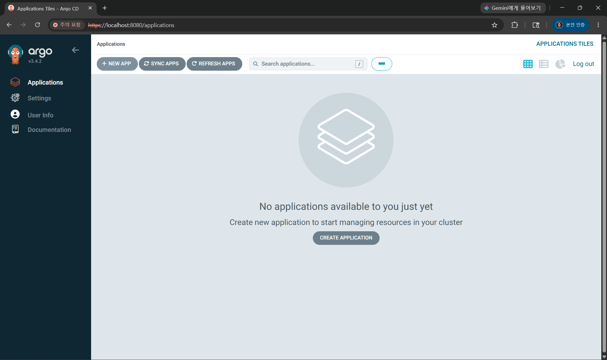
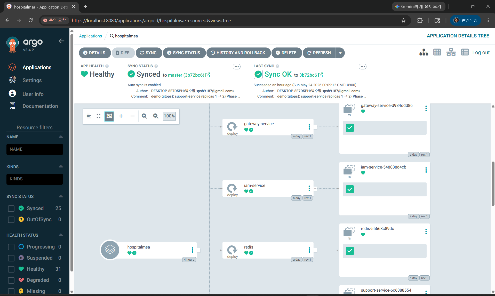

# 🏥 Hospital MSA — 병원 정보 시스템 포트폴리오

> **Spring Boot 3.x 기반 4개 마이크로서비스 + Next.js 14 풀스택 포트폴리오**  
> DDD / Kafka Choreography Saga / Outbox Pattern / Oracle XE 21c / React Query / Grafana + Tempo

---

## 📌 한 줄 요약 (면접 답변용)

> "MySQL로 설계한 4개 MSA를 Oracle XE로 직접 포팅하며 DB 방언 차이를 극복하고,  
> Kafka Outbox Saga로 분산 트랜잭션 없이 서비스 간 데이터 정합성을 보장했습니다.  
> React Query 서버 상태 분리, Grafana+Tempo 분산 추적, GitHub Actions CI까지 직접 구현했습니다."

---

## 🎯 프로젝트 목적

| 항목 | 내용 |
|------|------|
| 목적 | 실제 병원 업무 흐름(예약→접수→진료→오더→청구)을 MSA로 설계·구현 |
| 대상 | 토스뱅크·카카오페이 등 빅테크/핀테크 기업 기술 면접 포트폴리오 |
| 핵심 증명 | 분산 트랜잭션 없이 Saga 패턴으로 서비스 간 데이터 정합성 보장 |
| 추가 증명 | MySQL → Oracle 직접 포팅 경험, 분산 추적(Grafana+Tempo) 운영 경험 |

---

## 🏗️ 아키텍처

```
[Browser]
    │
    ▼
[Next.js 14 Frontend :3000]
    │  React Query (TanStack v5) / TypeScript / App Router
    │
    ▼
[Spring Cloud Gateway :8180]  ← 단일 외부 진입점 / JWT 검증 필터
    │
    ├──▶ [IAM Service :8181]          — 인증/인가, RBAC, RefreshToken (Redis)
    ├──▶ [Admin Master Service :8182] — 접수·예약·청구·환자 관리 (Oracle HIS_ADMIN)
    ├──▶ [Clinical Service :8183]     — 진료·EMR·SOAP·오더 관리 (Oracle HIS_CLINICAL)
    └──▶ [Support Service :8184]      — 검사·약제·방사선·워크리스트 (Oracle HIS_SUPPORT)

[Kafka + Zookeeper]  ← 비동기 이벤트 버스 (Outbox Pattern)
[Oracle XE 21c]      ← 4개 독립 스키마 (HIS_IAM / HIS_ADMIN / HIS_CLINICAL / HIS_SUPPORT)
[Redis]              ← RefreshToken 저장소
[Grafana :3001]      ← 분산 추적 시각화 (Tempo 연동)
[Tempo :3200]        ← OpenTelemetry Trace 수집
```

---

## ⚡ 핵심 기술 선택 근거 (면접 질문: "왜 이 기술을 선택했는가")

### 1. Kafka Choreography Saga — 왜 Orchestration이 아닌가

**문제:** 서비스 간 데이터 정합성을 2PC(Two-Phase Commit) 없이 보장해야 함  
**선택지 비교:**
- Orchestration Saga: 중앙 오케스트레이터가 단일 장애점(SPOF)이 됨
- **Choreography Saga 선택:** 각 서비스가 이벤트에 반응, 서비스 간 결합도 최소화

**트레이드오프:**
- 장점: 서비스 독립성 유지, Support 서비스 장애 시 Admin/Clinical 영향 없음
- 단점: 전체 흐름 추적이 어려움 → Grafana+Tempo 분산 추적으로 보완

**Outbox Pattern 도입 이유:**  
Kafka 발행과 DB 저장의 원자성 문제 해결. DB 트랜잭션 내에 Outbox 테이블 저장 → 별도 Publisher가 Kafka 발행. 메시지 유실 방지.

```
접수 등록 (Admin) → VISIT_REGISTERED 이벤트 발행
  → Clinical: visit_clinical_status INSERT (WAITING 상태)

검사오더 완성 (Clinical) → DIAGNOSTIC_ORDER_SUBMITTED 발행
  → Support: 워크리스트 생성

검사 완료 (Support) → DIAGNOSTIC_ORDER_COMPLETED 발행
  → Clinical: 최종오더 가능 상태 전환

최종오더 확정 (Clinical) → BILLING_REQUESTED 발행
  → Admin: 청구서 자동 생성 → BILLING_COMPLETED / BILLING_FAILED
```

---

### 2. MySQL → Oracle 포팅 — 트레이드오프와 배운 것

**배경:** 초기 MySQL로 설계 후 Oracle XE 21c로 직접 포팅

**실제 겪은 차이점과 해결:**

| 항목 | MySQL | Oracle | 해결 방법 |
|------|-------|--------|---------|
| AUTO_INCREMENT | 지원 | 미지원 | `GENERATED BY DEFAULT ON NULL AS IDENTITY` |
| IF NOT EXISTS | 지원 | 미지원(21c) | 단순 CREATE TABLE |
| BOOLEAN | 지원 | 미지원 | NUMBER(1) 대체 |
| IDENTITY 시퀀스 재설정 | ALTER SEQUENCE | ORA-32793 오류 | `ALTER TABLE MODIFY IDENTITY (START WITH N)` |
| Flyway PL/SQL | 자동 처리 | Community 파서 한계 | BEGIN/END 블록 제거, CREATE INDEX 분리 |

**트레이드오프:**
- Oracle 선택 이유: 스키마 레벨 격리로 MSA 서비스 경계 명확히 구현
- 포트폴리오 측면: MySQL → Oracle 마이그레이션 경험 자체가 차별점

---

### 3. React Query — Context API 대비 선택 이유

**문제:** 기존 Zustand/Context 기반 클라이언트 상태로는 서버 데이터 캐시 전략 구현 불가  
**선택:** TanStack Query v5 — 서버 상태와 클라이언트 상태 명확히 분리

**구현 결과:**
- `stale-while-revalidate` 전략으로 불필요한 API 호출 최소화
- `invalidateQueries` 기반 데이터 동기화
- 서버 모드(IAM 실로그인) / 로컬 모드(데모) 이중 소스 처리
- `authSource === "server"` 조건으로 서버 write 활성화 — `!!accessToken` 방식 배제 (XSS 고려)

---

### 4. JWT + RBAC (HttpOnly Cookie) — 보안 설계

**문제:** localStorage 저장 시 XSS 공격으로 토큰 탈취 가능  
**선택:**
- AccessToken: 메모리 보관 (JavaScript 변수)
- RefreshToken: HttpOnly Cookie → XSS로 접근 불가

**역할 체계:** SYS > ADMIN > DOC > NUR (`@PreAuthorize` 기반 메서드 보안)

---

### 5. Grafana + Tempo 분산 추적 — 왜 관측성이 필요했는가

**문제:** Kafka 이벤트 체인이 4개 서비스를 걸치면 장애 발생 시 원인 서비스 특정 불가  
**선택:** OpenTelemetry(OTLP) → Tempo 수집 → Grafana 시각화

**구현:**
- `micrometer-tracing-bridge-otel` + `opentelemetry-exporter-otlp`
- HTTP 4318 엔드포인트로 Trace 전송
- 적용 서비스: `admin-master-service`, `clinical-service`, **`gateway-service` (post-pres-2 PR로 추가)**

**Gateway 트레이스 — JWT 인증 필터 체인 가시화** *(post-pres-2 PR, 2026-04-24)*



Gateway가 `/api/admin/dashboard/summary` 요청을 받았을 때 생성되는 3-span trace:

```
gateway-service: http get                (2.54ms) ─ 전체 요청 lifecycle
  └─ security filterchain before         (1.74ms) ─ JWT 검증 단계 (병목 가시화)
      └─ security filterchain after      (165µs)  ─ 응답 처리 단계
```

**적용 패턴:** admin/clinical과 동일하게 Spring Boot 표준 의존성 + `application.yml`만 수정 (별도 javaagent jar 불필요 → 전 서비스 일관)

**향후 작업 (별 PR 분리):**
- Reactor Netty 다운스트림 client에 트레이스 컨텍스트 전파 추가 → admin/clinical과의 cross-service Waterfall 완결
- Phase 2-E 시점의 admin/clinical도 동기 HTTP server span 보강 검토

---

## 📊 전체 병원 플로우

```
예약 등록 (RESERVED)
    │
    ▼
예약내원 접수 / 현장 접수 (WAITING)   ← Admin Master Service
    │  [Kafka] VISIT_REGISTERED →  Clinical: visit_clinical_status 자동 생성
    ▼
진료 시작 (IN_TREATMENT)              ← Clinical Service
    │  SOAP 작성 + 검사 오더
    │  [Kafka] DIAGNOSTIC_ORDER_SUBMITTED → Support: 워크리스트 생성
    ▼
검사 완료 (EXAM_DONE)                 ← Support Service
    │  [Kafka] DIAGNOSTIC_ORDER_COMPLETED → Clinical: 최종오더 가능
    ▼
최종 오더 확정                         ← Clinical Service
    │  [Kafka] BILLING_REQUESTED → Admin: 청구서 자동 생성
    ▼
청구 완료 (COMPLETED)                 ← Admin Master Service
    │
    ▼
원무직원 접수목록에서 삭제 가능
```

---

## 🛠️ 기술 스택

| 영역 | 기술 |
|------|------|
| Backend | Spring Boot 3.x, Java 17, Spring Security, Spring Cloud Gateway |
| Database | Oracle XE 21c, Flyway, Spring Data JPA |
| Messaging | Apache Kafka, Zookeeper, Transactional Outbox Pattern |
| Cache | Redis (RefreshToken) |
| Frontend | Next.js 14 (App Router), TypeScript, React Query (TanStack v5) |
| Observability | Grafana, Grafana Tempo, OpenTelemetry (OTLP) |
| Container | Docker, Docker Compose (10 containers + 2 observability) |
| Auth | JWT (HMAC-SHA256), RBAC, HttpOnly Cookie |
| Test | JUnit5, Mockito (18개 단위 테스트, 6개 파일) |
| CI/CD | GitHub Actions (push 시 자동 테스트) |
| Build | Gradle 8.x, Yarn |

---

## 🚀 로컬 실행 방법

### 사전 요구사항
- Docker Desktop (Windows)
- Git

### 실행

```cmd
:: 1. 클론 (master에 모든 변경사항 머지 완료)
git clone https://github.com/parksubeom99/hospitalMSA.git
cd hospitalMSA

:: 2. 전체 스택 기동 (Oracle 포함 12컨테이너)
docker compose -f docker-compose-oracle.yml up -d

:: 3. 컨테이너 상태 확인 (전부 Healthy 확인)
docker compose -f docker-compose-oracle.yml ps

:: 4. 브라우저 접속
:: http://localhost:3000        (병원 HIS 시스템)
:: http://localhost:3001        (Grafana 분산 추적)
:: 로그인: system / system (SYS 권한)
```

### 컨테이너 구성

| 컨테이너 | 역할 | 포트 |
|---------|------|------|
| psb-frontend | Next.js 14 | 3000 |
| psb-gateway | Spring Cloud Gateway | 8180 |
| psb-iam | IAM Service | 8181 |
| psb-admin | Admin Master Service | 8182 |
| psb-clinical | Clinical Service | 8183 |
| psb-support | Support Service | 8184 |
| psb-oracle | Oracle XE 21c | 1522 |
| psb-kafka | Apache Kafka | 9092 |
| psb-zookeeper | Zookeeper | 2181 |
| psb-redis | Redis | 6379 |
| psb-tempo | Grafana Tempo | 3200, 4318 |
| psb-grafana | Grafana | 3001 |

---

## 📁 프로젝트 구조

```
hospitalMSA/
├── csBackend/
│   ├── gatewayService/       — Spring Cloud Gateway, JWT 검증 필터
│   ├── iamService/           — 인증·인가, RBAC, RefreshToken
│   ├── adminMasterService/   — 접수·예약·청구·환자·대기열
│   │   └── src/test/         — 6개 파일 / 18 @Test (Saga Consumer + 회귀 방지)
│   ├── clinicalService/      — 진료·EMR·SOAP·오더·Saga Consumer
│   └── supportService/       — 검사·약제·방사선·워크리스트
├── csFrontend/               — Next.js 14, React Query, TypeScript
│   └── src/
│       ├── app/              — App Router 페이지
│       ├── features/         — 화면별 컴포넌트 (DDD Feature Slicing)
│       └── shared/           — 공통 서비스·스토어·타입
├── docker/
│   ├── oracle/init/          — Oracle 스키마 초기화 SQL (startup 경로)
│   ├── tempo/                — Tempo YAML 설정
│   └── grafana/              — Grafana 프로비저닝 (datasource 자동 설정)
└── .github/workflows/
    └── ci.yml                — GitHub Actions CI (push 시 JUnit5 자동 실행)
```

---

## 🔑 주요 설계 결정 (ADR)

### ADR-001: 서비스 간 통신 — 동기 vs 비동기 이분 원칙

- **결정:** REST(동기) / Kafka(비동기) 명확히 분리
- **동기 사용:** IAM 인증 확인 (Gateway → IAM), 실시간 응답 필요 조회
- **비동기 사용:** 도메인 이벤트 전파 (접수→진료→검사→청구 전 체인)
- **근거:** 장애 격리. Support 서비스 다운 시 Admin/Clinical 서비스 정상 운영 가능
- **트레이드오프:** 최종 일관성(Eventually Consistent) 허용 vs 즉시 일관성 포기

---

### ADR-002: Transactional Outbox Pattern

- **결정:** 각 서비스 DB에 `outbox_event` 테이블 별도 운영
- **문제:** Kafka 발행 성공 + DB 저장 실패 → 데이터 불일치 위험
- **해결:** DB 트랜잭션 내 Outbox 저장 → Publisher가 NEW → PUBLISHED 전환 후 Kafka 발행
- **구현:** `@Scheduled(fixedDelay=2000ms)` 폴링 방식
- **트레이드오프:** 2초 지연 허용 vs 메시지 유실 방지 선택. 병원 업무 특성상 2초 지연 허용 가능

---

### ADR-003: Oracle 다중 스키마 vs 다중 DB 인스턴스

- **결정:** Oracle XE 단일 인스턴스 + 4개 독립 스키마 (HIS_IAM / HIS_ADMIN / HIS_CLINICAL / HIS_SUPPORT)
- **대안:** MySQL 4개 DB 유지 vs Oracle 다중 인스턴스
- **근거:** 포트폴리오 환경 운영비 최소화, 스키마 격리로 MSA DB 경계 유지
- **제약:** 서비스 간 스키마 직접 JOIN 금지 — 코드 레벨에서 강제 (아키텍처 규칙)
- **MySQL → Oracle 포팅 경험:** IDENTITY 컬럼, Flyway Community 파서 한계, Oracle 방언 차이 직접 해결

---

### ADR-004: React Query 서버/클라이언트 상태 분리

- **결정:** Zustand(클라이언트 상태) + React Query(서버 상태) 병존 구조
- **이유:** 데모 모드(로컬 시드 데이터)와 서버 모드(IAM 실로그인) 동시 지원 필요
- **핵심 패턴:** `authSource === "server"` 조건으로 서버 write 활성화
- **트레이드오프:** 두 가지 상태 소스 관리 복잡도 증가 vs 데모 시연 가능성 유지

---

### ADR-005: Grafana + Tempo 관측성 도입

- **결정:** Jaeger/Zipkin 대신 Grafana Tempo 선택
- **이유:** Grafana 단일 UI에서 메트릭·로그·트레이스 통합 가능, Spring Boot 3.x OTLP 공식 지원
- **구현:** micrometer-tracing-bridge-otel + opentelemetry-exporter-otlp (HTTP 4318 엔드포인트)
- **확인:** Admin/Clinical 서비스 Waterfall Trace 5 Spans (Security FilterChain 포함) 검증 완료

→ 실제 Waterfall 화면: [📊 분산 추적 실증 자료](#-분산-추적-실증-자료-grafana--tempo)

---

### ADR-006: ArgoCD Full GitOps 채택

- **결정:** Docker Compose → K8s 매니페스트 → Helm 차트 → ArgoCD Application 단계적 진화
- **이유:** GitOps SSOT 원칙 — Git 커밋이 곧 배포 트리거. 수동 `kubectl` 누락·실수 차단, 클러스터 상태가 항상 Git과 일치
- **구현:** `syncPolicy.automated` + `prune: true` + `selfHeal: true` 풀 자동화. K8s 시스템 기본값 4종(`volumeMode`, `persistentVolumeClaimRetentionPolicy`, `podManagementPolicy`, `revisionHistoryLimit`)은 `ignoreDifferences`로 분리
- **트러블슈팅:** `ServerSideApply=true` syncOption이 StatefulSet에서 ArgoCD diff 알고리즘과 마찰을 일으켜 perpetual OutOfSync 발생 → client-side apply로 회귀하여 해결
- **확인:** `support-service.replicaCount` 1→2 커밋 → ArgoCD ~4분 내 자동 sync 검증 완료

→ 실제 UI 화면: [🚀 GitOps 실증 자료](#-gitops-실증-자료-argocd)

---

## 📊 분산 추적 실증 자료 (Grafana + Tempo)

Phase 2-E에서 도입한 분산 추적이 실제 작동하는 증거. 각 Trace는 Spring Boot `micrometer-tracing-bridge-otel` + `opentelemetry-exporter-otlp`가 자동 수집하여 Tempo에 저장된 결과를 Grafana Explore에서 시각화한 것.

### 1) Admin Service — HTTP Waterfall (정상 요청 · 18.87ms)



`http get /admin/dashboard/summary` — 5 spans 구성:
- **security filterchain before: 3.18ms**
- authorize request (JWT 검증): 416.41μs
- **secured request (컨트롤러 + DB): 13.27ms ← 전체의 70%**
- security filterchain after: 1.02ms

---

### 2) Clinical Service — HTTP Waterfall (콜드 스타트 병목 · 399.5ms)



`http get /clinical/visit-status` — 첫 요청 시 **Security filter chain 초기화 오버헤드가 202ms** 발생. 두 번째 요청부터는 Admin 수준(수 ms)으로 안정화.

→ 분산 추적 도입 효과: **이 콜드 스타트 병목을 span 단위로 분해·식별 가능**. Admin의 18ms와 Clinical 첫 요청 400ms 차이의 원인이 "비즈니스 로직이 아닌 Security 초기화"라는 사실을 데이터로 증명.

---

### 3) Admin Kafka Outbox Trace (비동기 이벤트 발행 · 1.95ms)



---

### 4) Clinical Kafka Outbox Trace (2.95ms)



`task integration-outbox-kafka-publisher.publish-ne` — **Outbox Pattern**으로 DB 트랜잭션과 Kafka 발행을 원자적으로 분리한 후 Publisher가 2초 간격 폴링으로 발행. 각 발행마다 독립 Trace 생성 → 비동기 이벤트 유실·중복 추적 가능.

---

### 5) Trace 리스트 — 집계 이력 (SLO 관리 근거)



Last 1 hour 기준 서비스별 호출 이력. Duration 컬럼으로 Outlier(이상치) 탐지 + `p99 latency` 같은 SLO 관리 근거 확보.

---

## 🚀 GitOps 실증 자료 (ArgoCD)

Phase 5에서 도입한 ArgoCD Full GitOps가 실제 작동하는 증거. `chart/` 디렉토리의 Helm 차트가 Git SSOT이며, master 브랜치 변경은 ArgoCD가 ~3분 폴링으로 자동 감지·동기화. `argocd/hospitalmsa-application.yaml`로 Application CR 자체도 Git에 선언.

### 1) 초기 상태 — Application 등록 직전



ArgoCD v3.4.2 설치 직후 빈 Applications 화면. 좌측 사이드바에 `Applications / Settings / User Info / Documentation` 4개 항목 — 클러스터에 아직 등록된 GitOps Application 없음.

---

### 2) hospitalmsa Application — Synced/Healthy + 자동 sync 실증



`chart/values.yaml`에서 `supportService.replicaCount: 1 → 2` 커밋·푸시 → **ArgoCD가 ~4분 내 자동 감지 + Sync 실행** → 클러스터에 반영 완료.

화면 핵심 지표:
- **SYNC STATUS:** Synced to `master (3b72bc6)` — 우리가 푸시한 커밋 SHA와 일치
- **APP HEALTH:** Healthy · **Auto sync is enabled**
- **LAST SYNC Comment:** `demo(gitops): support-service replicas 1 → 2 (Phase 5...)` ← 자동 sync를 유발한 그 커밋
- 좌측 필터: Synced **25** / OutOfSync **0** / Healthy **42** / Degraded **0** / Missing **0**
- 트리 뷰에 Deployment·StatefulSet·Service·ConfigMap·PVC 노드 펼쳐짐

GitOps 루프 완전 검증: **git push → ArgoCD 폴링 → 자동 sync → 클러스터 반영**. 수동 `kubectl apply` 0회.

#### 운영 노트 — 자동 sync는 영구, UI는 on-demand

- **자동 sync는 `argocd-application-controller` 파드가 24/7 수행** — 클러스터가 살아있는 한 영구. 노트북 부팅 후 Docker Desktop만 켜져 있으면 GitOps 루프는 자동 복구.
- **UI 접근만 별도 port-forward 필요** — Docker Desktop K8s(kind 기반)는 NodePort/LoadBalancer가 호스트 `localhost`에 자동 노출되지 않음. 따라서 UI 접근은 `kubectl port-forward`로 처리.
- 자동 재시작 래퍼: `scripts/argocd-portforward.ps1` (Ctrl+C 전까지 무한 재시도, Windows Task Scheduler 등록 가능)

```powershell
# UI 접근 (admin / `kubectl -n argocd get secret argocd-initial-admin-secret -o jsonpath='{.data.password}' | base64 -d`)
powershell -ExecutionPolicy Bypass -File scripts\argocd-portforward.ps1
# → https://localhost:8080
```

---

## 📈 Phase 현황

| Phase | 내용 | 상태 |
|-------|------|------|
| Phase 1 | MySQL 풀스택 Docker Compose (10컨테이너 healthy) | ✅ 완료 |
| Phase 2-A | Oracle XE 21c 포팅 + Flyway 4개 서비스 | ✅ 완료 |
| Phase 2-B | React Query 전 화면 서버 연동 | ✅ 완료 |
| Phase 2-C | Kafka VISIT_REGISTERED 체인 완성 + 멱등성 처리 | ✅ 완료 |
| Phase 2-D | JUnit5 / Mockito 단위 테스트 18개 (Saga 4종 + 회귀) + GitHub Actions CI | ✅ 완료 |
| Phase 2-E | Grafana + Tempo 분산 추적 Waterfall 확인 | ✅ 완료 |
| Phase 3 | AWS EC2 + RDS 클라우드 배포 | 🔄 진행 중 |
| Phase 4 | Docker Compose → K8s 매니페스트 + Helm 차트 마이그레이션 | ✅ 완료 |
| Phase 5 | ArgoCD Full GitOps (automated + prune + selfHeal) | ✅ 완료 |

---

## 🧪 테스트 현황

| 모듈 | 테스트 파일 | 테스트 수 | 핵심 검증 내용 |
|-----|-----------|---------|-------------|
| admin | VisitServiceTest | 4개 | 현장접수 생성, 예약내원 접수, 취소, Outbox 이벤트 발행 |
| admin | BillingRequestedConsumerTest | 3개 | Saga **수납 진입점** — Invoice 생성 + BILLING_COMPLETED outbox / 멱등성 / 예외 시 BILLING_FAILED 보상 |
| admin | ReservationServiceTest | 2개 | **회귀 방지** — 예약내원 체크인 시 status=CHECKED_IN + Visit 자동 매핑 (commit 03d50d6 대응) |
| clinical | VisitRegisteredConsumerTest | 3개 | Kafka Consumer 멱등성 처리, visit_clinical_status INSERT |
| clinical | BillingCompletedConsumerTest | 4개 | Saga 종료(BILLED 전환) + BILLING_FAILED 수동 보상 + 양방향 멱등성 |
| clinical | DiagnosticOrderCompletedConsumerTest | 2개 | 진단 오더 완결 → markFinalOrderReady + 멱등성 |
| **합계** | **6개 파일** | **18개** | Saga 핵심 분기 + 회귀 방지 |

**CI/CD:** `.github/workflows/ci.yml` — `master` 또는 `feature/phase2-oracle` push/PR 시 자동 실행
- `test-admin-master` 잡: adminMasterService 전체 단위 테스트 (9개 @Test)
- `test-clinical` 잡: clinicalService 전체 단위 테스트 (9개 @Test)

---

## 👤 개발자

| 항목 | 내용 |
|------|------|
| GitHub | https://github.com/parksubeom99 |
| 현재 개발 브랜치 | `feature/phase2-oracle` |
| `master` | Phase 1 MySQL 풀스택 기준선 (DB 포팅 비교 기준) |
